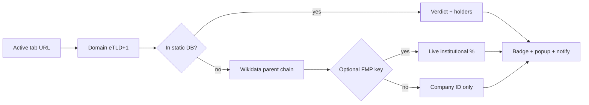

# No Kings

**See who owns the site you're browsing — in one click.**

> *BlackRock. Vanguard. State Street. They show up on almost every major company’s cap table.*
> **No Kings** maps the domain in your tab to its **parent company**, shows how much the **Big Three** index-fund giants hold — and surfaces **who actually has voting control** when it isn’t them.

  <strong>⭐ If this is useful, star the repo — it helps others find it.</strong>

---

## Why this exists

You’ve seen the charts: the same three asset managers at the top of every shareholder list. The question isn’t whether they *appear* everywhere — it’s **what that means**, and **who really runs the company**.

No Kings runs in your browser and answers, for the page you’re on right now:

- **Which company owns this website?** (parent org, ticker, sector)
- **How much do Vanguard + BlackRock + State Street hold combined?**
- **Who actually controls votes?** (founder/family/dual-class — Walmart, Meta, NYT, Fox, Nike, Alphabet, etc.)
- **Is the “they own this too” claim even valid?** (e.g. private companies like Calm)

No account. No tracking you. Data stays local unless you opt into live lookups.

---

## Quick demo

| Open this URL | You’ll see |
|---------------|------------|
| [apple.com](https://www.apple.com) | Apple Inc. + Big Three stake band |
| [disney.com](https://www.disney.com) | Walt Disney Co. |
| [walmart.com](https://www.walmart.com) | Walmart + **Walton family** control note |
| [calm.com](https://www.calm.com) | Private — claim doesn’t apply |
| [example.com](https://example.com) | Not in database / resolver path |

**Or** open the popup → **MANUAL QUERY** → type `netflix.com` → **RUN**.

<!-- Add a GIF here for maximum impact:  -->

---

## Install (2 minutes)

1. **Clone** this repo (or [download ZIP](https://github.com/Frank-Masciopinto/no-kings/archive/refs/heads/main.zip))
2. Open **`chrome://extensions`**
3. Enable **Developer mode** (top right)
4. Click **Load unpacked** → select the `no-kings` folder
5. **Pin** the extension → visit any site above

Works in **Chrome**, **Brave**, and **Edge** (same flow).

---

## Features

| Feature | What it does |
|---------|----------------|
| **Tab intelligence** | Reads the active tab, extracts the real domain (eTLD+1), resolves ownership |
| **Toolbar badge** | Combined Big Three % on the icon — colour-coded by stake band |
| **Desktop alerts** | Optional notification when stake crosses your threshold (once per domain per session) |
| **Wikidata resolver** | Unknown domains → parent org chain via Wikidata (no API key) |
| **Live data (optional)** | Paste a [Financial Modeling Prep](https://financialmodelingprep.com/) key for real institutional holdings |
| **Confidence chips** | `exact` / `high` / `medium` / `low` + source: `STATIC DB` · `WIKIDATA` · `+ LIVE` |
| **40+ tracked brands** | Apple, Google, Meta, Amazon, Disney, Walmart, JPMorgan, Pfizer, Boeing, and more |
| **Full entity list** | Popup → **VIEW ALL TRACKED ENTITIES** — ranked by combined stake |
| **Terminal UI** | CRT dossier aesthetic — built to screenshot well |

---

## Verdict bands

Combined **Vanguard + BlackRock + State Street** (% of shares outstanding):

| Band | Threshold | Badge |
|------|-----------|-------|
| **HEAVILY HELD** | ≥ 15% | Red |
| **PARTLY HELD** | 8–15% | Amber |
| **LIGHTLY HELD** | > 0–8% | Green |
| **CLAIM N/A** | Private company | Blue |
| **NOT IN DATABASE** | Unknown / unresolved | Grey |

---

## How it works

**Offline-first:** the built-in dataset always works. Network paths (Wikidata, live API) degrade gracefully — you never get a broken popup.

---

## Settings

Click **⚙** in the popup:

- Toggle **auto-notify** and set **threshold %**
- Add an optional **FMP API key** (stored in `chrome.storage.local` only; sent only to the data provider)

---

## Project structure

| File | Role |
|------|------|
| `manifest.json` | MV3 config |
| `background.js` | Service worker — auto-resolve, badge, notifications |
| `resolver.js` | Domain → company → holders; Wikidata + cache + live adapter |
| `data.js` | Static ownership dataset + `BIG_THREE` list |
| `popup.html` / `popup.css` / `popup.js` | Dossier UI |
| `icons/` | 16 / 48 / 128 toolbar icons |

---

## Transparency (read this once)

We’re not here to feed a cartoon villain narrative — we’re here to **make the claim inspectable**.

1. **Static numbers are illustrative.** Percentages in `data.js` are rounded, frozen approximations — not live filings. Turn on an FMP key for runtime data.
2. **The Big Three everywhere is real — and mostly mundane.** They run index funds and ETFs **on behalf of millions of pensioners and 401(k) holders**. “Vanguard owns 8% of Apple” ≈ “everyone who owns Vanguard funds, collectively.”
3. **Control ≠ cap table.** Many flagged companies are **founder- or family-controlled** via dual-class stock. The extension shows both — because the meme skips that part.
4. **Private brands get misfiled.** `calm.com` is in the DB on purpose: privately held, so the public-shareholder frame doesn’t even apply.

**Framing that holds up under scrutiny:** *reproduce the “they own everything” headline, then show where it breaks.*

---

## Roadmap

- [ ] Chrome Web Store listing
- [ ] Demo GIF in `docs/`
- [ ] Expand static dataset (PRs welcome)
- [ ] SEC EDGAR 13F adapter

---

## Contribute

Found a wrong parent mapping? Know a domain that should be in the static DB?

1. [Open an issue](https://github.com/Frank-Masciopinto/no-kings/issues)
2. Or fork → branch → PR

**Good first issues:** add domains to `data.js`, improve Wikidata parent-chain heuristics, tighten copy in the popup.

---

## Star history

If No Kings helped you **follow the money** on the open web, a ⭐ on [github.com/Frank-Masciopinto/no-kings](https://github.com/Frank-Masciopinto/no-kings) is the best way to spread it.

---

## License

MIT — use it, fork it, teach with it. Attribution appreciated.

---

  Built for people who ask <strong>who owns the internet</strong> — not to replace due diligence, but to start it.

